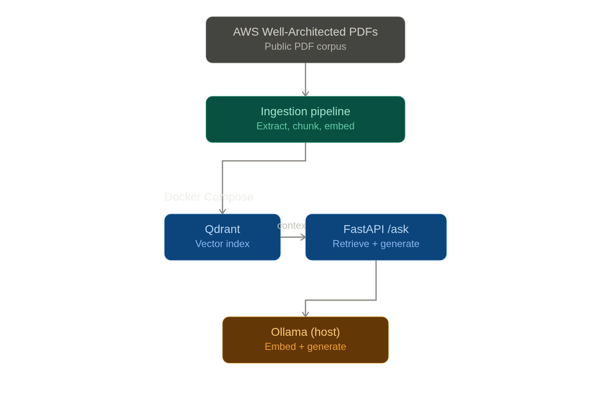

# RAG Knowledge Assistant

A retrieval-augmented generation (RAG) system answering questions over
AWS Well-Architected Framework whitepapers — a public stand-in for
internal solution/process design documents. Built entirely on local,
self-hosted, zero-cost infrastructure: local LLM (Ollama), self-hosted
vector database (Qdrant), open-source embeddings — hand-rolled
orchestration (not LangChain/LlamaIndex) for deep understanding of every
mechanic, with an explicit migration path to any hosted API later.


## Status

✅ Phases 0-6 complete: ingestion, embeddings/retrieval, generation with
citations, serving API, evaluation harness, Docker Compose.

## Why this project exists

Project 2 of a structured ML/AI engineering roadmap. Builds on Project
1's engineering discipline (testing, typing, CI, Docker, config
management, cost/quality-aware decision-making) applied to
retrieval-augmented generation.

## Tech stack

| Concern | Choice | Why |
|---|---|---|
| LLM serving | Ollama, kept on the **host** (not containerized) | See "Hardware-specific setup" below |
| Generation model | `qwen3:14b` | Real evaluation data: qwen3:8b produced a degenerate "list of questions instead of an answer" on 3/12 real questions; 14b showed zero such failures |
| Embedding model | `qwen3-embedding:0.6b` | Asymmetric embedding (query vs. document instructions) |
| Vector database | Qdrant, containerized (server mode) | Migrated from local/embedded mode in Phase 6 SQLite→Postgres migration |
| Judge model (evaluation only) | `qwen3:14b` | qwen3:8b degenerated under the judge workload's rapid, structurally-similar prompts even after the hardware fix below — a genuine, separate capacity limitation |
| Orchestration | Hand-rolled (no LangChain/LlamaIndex) | Deliberate |
| Evaluation | Hand-rolled Faithfulness + Answer Relevancy | RAGAS has a currently-broken dependency chain (see `evaluation/metrics.py` docstring) |

Everything runs self-hosted/local — $0/month infrastructure cost.

## ⚠️ Hardware-specific setup (read this first)

On this project's development hardware (Ryzen AI Max+ 395 / `gfx1151`),
Ollama's default ROCm backend produces **silent output corruption** —
repetition-loop garbage with no error logged. Confirmed via Ollama's own
server logs and a matching public bug report. Fix: force the Vulkan iGPU
path instead, via a systemd override:

```bash
sudo systemctl edit ollama.service
```

Add:
```ini
[Service]
Environment="OLLAMA_IGPU_ENABLE=1"
```

Then:
```bash
sudo systemctl daemon-reload
sudo systemctl restart ollama
```

If you're on different hardware, this may not apply — but if you see
repeated/garbled model output with no server-side error, check
`ollama ps` and your server logs for backend selection before assuming
it's a code bug.

## Local setup

```bash
curl -LsSf https://astral.sh/uv/install.sh | sh
git clone
